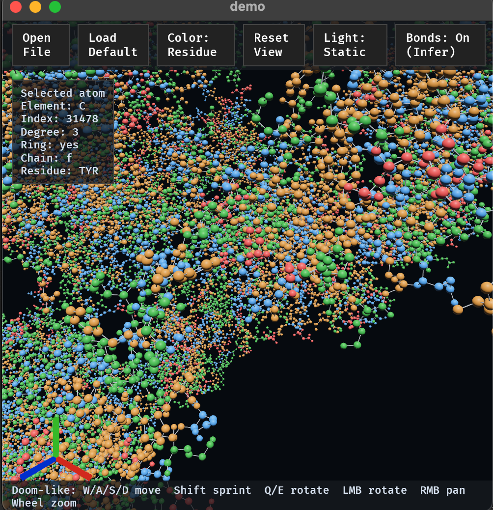

# vizmat

Molecule and crystal visualizer go brrr

`vizmat` is an experimental project to build a crystal structure visualizer in Rust using [Bevy](https://bevyengine.org/).

This project started as part of a rust learn and hack session at Paul Scherrer Institute — going line by line through code, learning Bevy and Rust fundamentals together, and gradually building up toward a minimal viable product.

This project is an educational experiment:

- We discuss Rust basics, Bevy concepts, and code structure as a group (mix of rust beginners and some are already fluent in rust but new to bevy/wasm).
- Each session recaps progress, explains new code, and sets up the next steps
- By the end, several contributors will have hands-on knowledge of Bevy and Rust from scratch, a good foundation for an open-source project

## Contributing & Development Setup

Contributions are welcome. This project uses Rust and Bevy. Familiarity with Rust tooling and basic CLI usage is assumed.

Clone with submodules (required for structure datasets):

```bash
git clone --recurse-submodules https://github.com/rs4rse/vizmat.git
```

If you already cloned:

```bash
git submodule update --init --recursive
```

### Windows

* Install Rust via `rustup` (MSVC toolchain)
* Optional: Vulkan SDK

```powershell
cargo run
cargo run --release
```

### Linux

Install Rust via `rustup`, then required system libraries.

Ubuntu:

```bash
sudo apt install build-essential \
    pkg-config libx11-dev libasound2-dev libudev-dev \
    libxkbcommon-dev mesa-vulkan-drivers vulkan-utils
cargo run
cargo run --release
```

### macOS

```bash
brew install cmake pkg-config
cargo run
cargo run --release
```

(Bevy uses Metal; no Vulkan needed.)

## wasm

It require rustc target `wasm32-unknown-unknown` installed.
To run wasm version, install `trunk` and run it inside the binary folder `vizmat-app/`.

```console
cd vizmat-app
trunk serve
```

then open the link in your favorite browser. 

(Bevy on browser use wgpu)

## Controls

Doom-like: `W/A/S/D` move perspective, `Shift` sprint, `Q/E` rotate view left/right, mouse drag rotates.

## Sample Proteins

Create a larger test structure (SARS-CoV-2 spike):

```bash
just protein-6vxx
```

Create a very large ribosome test structure:

```bash
just protein-3j3a
```

## Sample SDF Compounds

Download all example SDF files (NAX, ESM, Vancomycin, Cyclosporin A):

```bash
just download-sdf
```

## Screenshots

Cyclosporin (Element):


Cyclosporin (Bond Env):


PDB (Residue + Selected Atom Legend):



## Roadmap

* [x] Initial Bevy setup
* [x] Basic crystal visualization (desktop)
* [x] Browser support via WASM
* [x] Extend with interactivity and file parsing
* [x] Build community contributions
- [x] Windows support
- [x] CI/CD to compile and publish the binary for different archs.
- [x] coordinator system
- [x] use mouse to control
- [x] the atom info box color contrast not obvious in light mode
- [ ] add button to toggle projection.
- [ ] the radii of atom hover is too small when zoomed in.
- [ ] atom info and atom selected when atom overlap, use the distance to camera not to the cursor (?).
- [ ] second click on selected atom will unselect it.
- [ ] flex of buttons in hud.
- [ ] bonds has half-half color of connected atoms.
- [x] open file not work in wasm
- [x] add github badge in wasm app for star
- [x] load default become a dropdown to get files from gallary (c6h6 and water in the repo). 
- [ ] load default -> load example and should still work after there is loaded structure.
- [ ] showing one molecule, one protein and one crystal in the first page before user's structure load.

## Contributing

We are at an early stage and welcome contributions.
If you are new to Rust, Bevy, or visualization, this is the perfect playground.

## License

All contributions must retain this attribution.

- Apache License, Version 2.0 ([LICENSE-APACHE](LICENSE-APACHE) or http://www.apache.org/licenses/LICENSE-2.0)
- MIT license ([LICENSE-MIT](LICENSE-MIT) or http://opensource.org/licenses/MIT)
